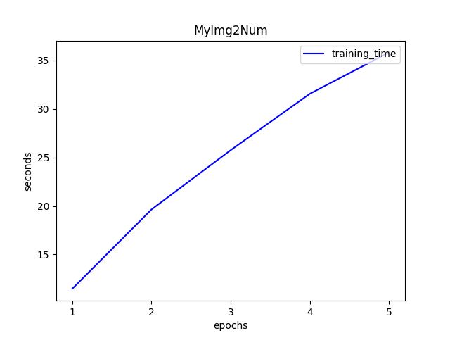
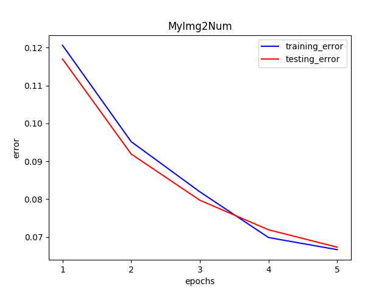
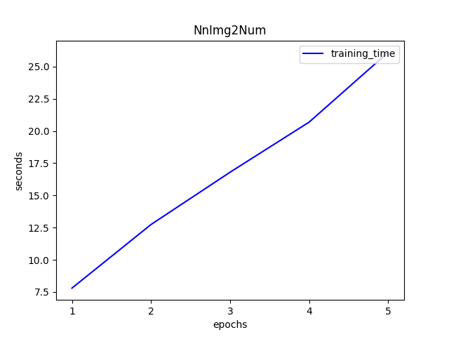

# BME-595 Assignment 04

The following are the speed/error VS epochs charts on the MNIST training dataset and testing dataset. According to the charts, the trending of MyImg2Num's training time and errors is the same as NnImg2Num's. However, NnImg2Num performs better on training time and errors, it might be due to a better implementation.

Experiment settings: batch-size (128), eta (0.2), epoch (5)

Training dataset: 60000 images, size of each image is 28x28

Testing dataset: 60000 images, size of each image is 28x28

## MyImg2Num

Train the MyImg2Num network using the MNIST dataset using the NeuralNetwork API. To speed up training, you may want to use the NeuralNetwork API in batch mode (where you forward chunks of the design and target matrices at a time). This means that if size(x) = n and you have m examples, then size(X) = m × n (I know it is transpose of what you were providing in last homework) and NeuralNetwork’s forward() can take x or X and NeuralNetwork’s backward() can take y or Y. Output of NeuralNetwork’s forward() will be m × c (where m is number of examples and c is number of classes/categories).

### Training time

### Training/Testing error

## NnImg2Num

1. Update your code in order to create your network, perform forward and back-prop using Pytorch’s nn package.
2. In order to update parameters use optim package.
3. Compare speed and training error vs epochs charts.

### Training time

### Training/Testing error

